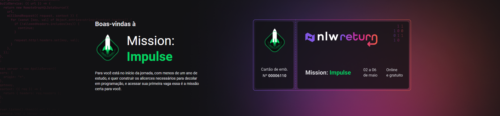

<h1 align="center">
  
</h1>

# nlw-returns
A whole week to take you to the next level by building a complete, exclusive and never-before-seen application with the RockeatSeat team

 

# Motto to embark on the next journeys.
The journey to the next level is endless.

 

The next level is never the last and each level is a unique quest with different challenges and different rewards

 

## 💻 Project

Feedback component, interactive for any application.

 

## ✨ Technologies Front Used
-   [Typescript](https://www.typescriptlang.org/) 
-   [Vite](https://vitejs.dev/) 
-   [Tailwind](https://tailwindcss.com/docs/installation/using-postcss) 
-   [Phosphoricons](https://phosphoricons.com/) 
-   [Headless ui](https://headlessui.dev/) 

 

## ✨ Technologies Back Used
-   [Nodejs](https://nodejs.org/en/) 
-   [Typescript](https://www.typescriptlang.org/) 
-   [SQLite](https://www.sqlite.org/index.html) 
-   [Prisma](https://www.prisma.io/) 
-   [Nodemailer](https://nodemailer.com/about/) 
-   [Mailtrap](https://mailtrap.io/) 
-   [Jestjs](https://jestjs.io/) 

 

## ✨ Technologies Mobile Used

-   [React Native](https://reactnative.dev/)
-   [Expo](https://expo.dev/)
-   [Phosphor React Native](https://www.npmjs.com/package/phosphor-react-native)

 

## ✨ Hosting Services Used

-   [Vercel](https://vercel.com/about) 
-   [Railway](https://railway.app/) 

## 🔖 Layout

You can view the first part of the project through [this link](https://nlw-returns.vercel.app/). Please leave your feedback 👊👊.